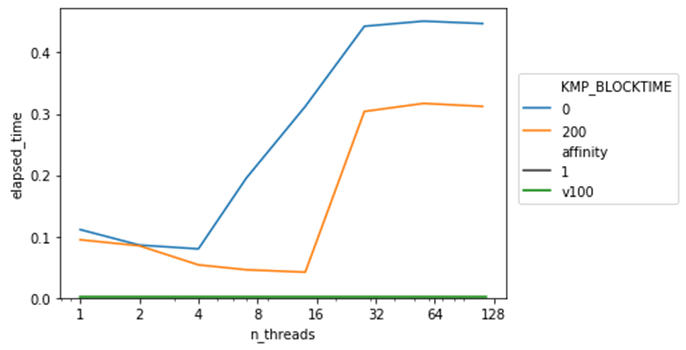
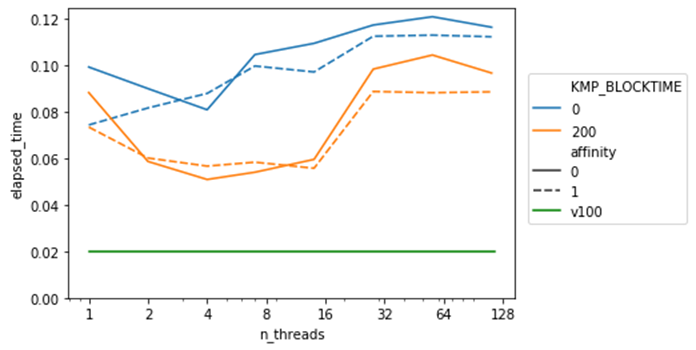
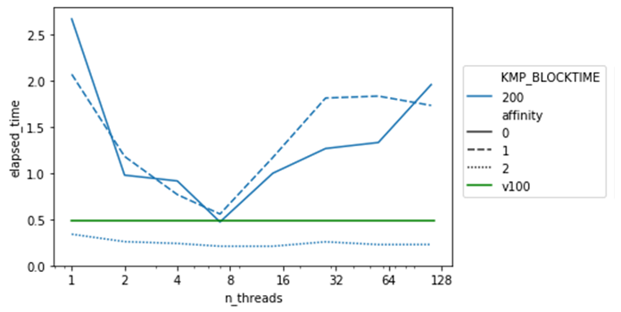

# Results

|        | GPU     | CPU    |   |   |   |
|--------|---------|--------|---|---|---|
| CNN    | 0.00267 | 0.0420 |   |   |   |
| RNN    | 0.05    | 0.02   |   |   |   |
| Sparse | 0.482   | 0.209  |   |   |   |

## CNN


## RNN


GPU: 0.028162002563476562

## Sparse



## Models
Benchmarks iterate a forward and backward step for each architecture.

- **CNN**: 2 convolutional layers, 3 feedforward layers
- **RNN**: RNN implementation optimized using [torch.jit](https://pytorch.org/docs/stable/jit.html), 200 hidden units
- **sparse**: 4 sparse layers

Notice that sparse layers are experimental. They do not support MKL and they seem to be orders of magnitude slower than equivalent dense layers.


# Hardware & Software Configuration
**GPU**: Nvidia V100

**CPU**:
- CPU(s): 56
- Thread(s) per core: 2
- Core(s) per socket: 14
- Socket(s): 2
- NUMA node(s): 2
- Model name: Intel(R) Xeon(R) Gold 5120 CPU @ 2.20GHz

**parameter sweep**:
- Number of threads: OMP_THREADS
- Thread blocking: KMP_BLOCKTIME
- Affinity: KMP_AFFINITY
    - KMP_AFFINITY=granularity=fine,compact,1,0
    - KMP_AFFINITY=noverbose,warnings,respect,granularity=core,none


**MKL settings (default)**:
```
   KMP_ABORT_DELAY=0                                                                     
   KMP_ADAPTIVE_LOCK_PROPS='1,1024'                                                      
   KMP_ALIGN_ALLOC=64                                                                    
   KMP_ALL_THREADPRIVATE=128                                                             
   KMP_ATOMIC_MODE=2                                                                     
   KMP_BLOCKTIME=200                                                                     
   KMP_CPUINFO_FILE: value is not defined                                                
   KMP_DETERMINISTIC_REDUCTION=false                                                     
   KMP_DEVICE_THREAD_LIMIT=2147483647                                                    
   KMP_DISP_HAND_THREAD=false                                                            
   KMP_DISP_NUM_BUFFERS=7                                                                
   KMP_DUPLICATE_LIB_OK=false                                                            
   KMP_FORCE_REDUCTION: value is not defined                                             
   KMP_FOREIGN_THREADS_THREADPRIVATE=true                                                
   KMP_FORKJOIN_BARRIER='2,2'                                                            
   KMP_FORKJOIN_BARRIER_PATTERN='hyper,hyper'                                            
   KMP_FORKJOIN_FRAMES=true                                                              
   KMP_FORKJOIN_FRAMES_MODE=3                                                            
   KMP_GTID_MODE=3                                                                       
   KMP_HANDLE_SIGNALS=false                                                              
   KMP_HOT_TEAMS_MAX_LEVEL=1                                                             
   KMP_HOT_TEAMS_MODE=0                                                                  
   KMP_INIT_AT_FORK=true                                                                 
   KMP_ITT_PREPARE_DELAY=0                                                               
   KMP_LIBRARY=throughput                                                                
   KMP_LOCK_KIND=queuing                                                                 
   KMP_MALLOC_POOL_INCR=1M                                                               
   KMP_MWAIT_HINTS=0                                                                     
   KMP_NUM_LOCKS_IN_BLOCK=1                                                              
   KMP_PLAIN_BARRIER='2,2'                                                               
   KMP_PLAIN_BARRIER_PATTERN='hyper,hyper'                                               
   KMP_REDUCTION_BARRIER='1,1'                                                           
   KMP_REDUCTION_BARRIER_PATTERN='hyper,hyper'                                           
   KMP_SCHEDULE='static,balanced;guided,iterative'                                       
   KMP_SETTINGS=true                                                                     
   KMP_SPIN_BACKOFF_PARAMS='4096,100'                                                    
   KMP_STACKOFFSET=64                                                                    
   KMP_STACKPAD=0                                                                        
   KMP_STACKSIZE=8M                                                                      
   KMP_STORAGE_MAP=false                                                                 
   KMP_TASKING=2                                                                         
   KMP_TASKLOOP_MIN_TASKS=0                                                              
   KMP_TASK_STEALING_CONSTRAINT=1                                                        
   KMP_TEAMS_THREAD_LIMIT=32                                                             
   KMP_TOPOLOGY_METHOD=all                                                               
   KMP_USER_LEVEL_MWAIT=false                                                            
   KMP_USE_YIELD=1                                                                       
   KMP_VERSION=false                                                                     
   KMP_WARNINGS=true                                                                     
   OMP_AFFINITY_FORMAT='OMP: pid %P tid %i thread %n bound to OS proc set {%A}'          
   OMP_ALLOCATOR=omp_default_mem_alloc                                                   
   OMP_CANCELLATION=false                                                                
   OMP_DEBUG=disabled                                                                    
   OMP_DEFAULT_DEVICE=0                                                                  
   OMP_DISPLAY_AFFINITY=false                                                            
   OMP_DISPLAY_ENV=false                                                                 
   OMP_DYNAMIC=false                                                                     
   OMP_MAX_ACTIVE_LEVELS=2147483647                                                      
   OMP_MAX_TASK_PRIORITY=0                                                               
   OMP_NESTED=false                                                                      
   OMP_NUM_THREADS: value is not defined                                                 
   OMP_PLACES: value is not defined                                                      
   OMP_PROC_BIND='false'                                                                 
   OMP_SCHEDULE='static'                                                                 
   OMP_STACKSIZE=8M                                                                      
   OMP_TARGET_OFFLOAD=DEFAULT                                                            
   OMP_THREAD_LIMIT=2147483647                                                           
   OMP_TOOL=enabled                                                                      
   OMP_TOOL_LIBRARIES: value is not defined                                              
   OMP_WAIT_POLICY=PASSIVE                                                               
   KMP_AFFINITY='noverbose,warnings,respect,granularity=core,none'                       
```